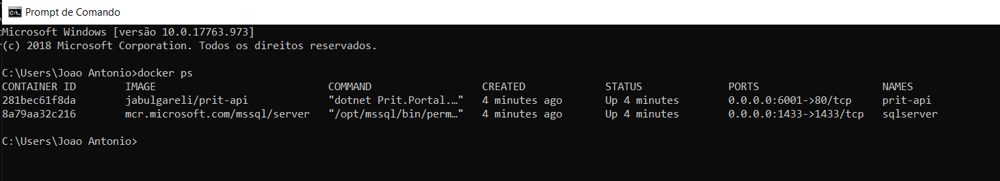

# DesafioPrit
Solução para o desafio proposto pela Prit baseado nesse [link](https://docs.google.com/document/d/14NeUqErTiIyE6v4ZXWuCWnjRUNnUbdr13JSmwRCn2UU/edit).

## Tecnologias
Mesmo que simples, a aplicação está dividida baseada nas sugestões do DDD para menor acoplamento e mais facilidade de extensão/manutenção.

- ASP .NET Core 2.2
- Entity Framework Core
- Docker
- SQL Server
- Identity
- Bootstrap
- Axios

## Como executar

Como já mencionado o projeto utiliza containers Docker, para execução basta realizar o download do arquivo [docker-compose.yml](docker-compose.yml), abrir o bash e navegar até a pasta do docker-compose.yml e executar o comando abaixo:

    docker-compose up

Executar o comando para verificar se os containers estão em execução:

    docker ps

Endereço:
- Portal: http://localhost:6001

O banco de dados será criado automáticamente através das migrações. 
Para entrar no portal, basta realizar o cadastro através do link exibido.

## Propostas futuras
- Separar o backend em APIs para facilitar a escala e reuso do portal
- Converter o frontend para React
